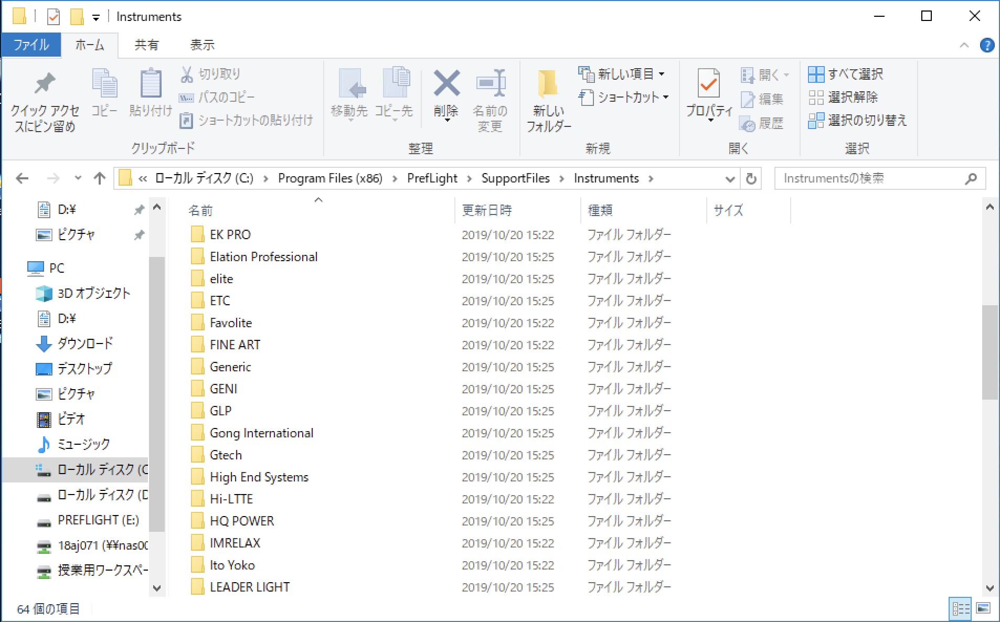

# Preflight-Fixture-Pub

Kwatec社のPreflight用のフィクスチャーライブラリの配布。

## ダウンロード

<b><u>[⬇️ダウンロード⬇️](https://github.com/magcho/preflight-fixture-pub/archive/master.zip)</u></b>

## 配布中のフィクスチャー

- [COLORBARLEDⅡ 【Stage Evolutoin】](https://www.soundhouse.co.jp/products/detail/item/212382/)
- [LED WASH 【ノーブランド】](https://www.aliexpress.com/item/32971455218.html)

```
 fixtures
 ├── STAGE\ EVOLUTION
 │   └── COLORBARLEDII
 └── TBC
     └── LED\ WASH
```

## 導入方法

以下の要件を満たしている必要があります。
- Preflightをインストール済み
- PCの管理者権限を持つユーザーである、または管理者権限のユーザーにログインできる。


**Windows**
1. Preflightのインストールフォルダを開く

   デフォルトでは`C¥Program Files(x86)¥Preflight`にインストールされています。
   
2. フィクスチャーデータのフォルダを開く

   `PrefLight¥SupportFiles¥Instruments`を開いてください。フィクスチャーのメーカ別のフィクスチャーデータが入っています。
   
    

3. ダウンロードしたフィクスチャーデータをフォルダ内へ入れる

   ダウンロードしたzipファイルを解凍した`fixtures`フォルダ内に配布しているフィクスチャーデータが入っています。
   
   メーカー名のフォルダを先ほど開いた`Instruments`フォルダに入れてください。既に同名のフォルダが存在するときは中身のみを入れてください。
   
    

**MacOS**
1. Preflightのインストールフォルダを開く

   デフォルトでは`/Applications/PrefLight.app`にインストールされています。
   
   Finderの設定により`/Applications`フォルダが表示されていないことがあります。一度Preflightを起動しDock上のPreflightアイコンを`Command ⌘`キーを押しながらクリックすることでインストールフォルダが開きます。
   
    
   
2. PrefLight.appを右クリックし、パッケージの内容を表示をクリック

    

3. フィクスチャーデータのフォルダにダウンロードしたファイルを追加

   `PrefLight.app/Contents/SharedSupport/Instruments`を開くとフィクスチャーのメーカー別にフォルダ分けされたフィクスチャーデータが表示されます。
   
   ダウンドードしたzipファイルを解凍し、`fixtures`フォルダ内のメーカー名のフォルダごと`Instruments`フォルダへ入れてください。
    
   
   既に`Instruments`内に同名のフォルダがある場合はフォルダの中の機材名のファイルを入れてください。
   
   
4. フィクスチャーが追加されたか確認

   PrefLightを起動し装置メニュー内ににフィクスチャーが追加されていることを確認してください。
   
   フィクスチャーが追加されない場合はPreflightを再起動し、再度装置メニュー内を確認してください。


## アップデート

フィクスチャーデータの追加のほか、データ自体を修正することがあります、現在インストールされているフィクスチャーデータのバージョンは追加時に確認できます。


   
